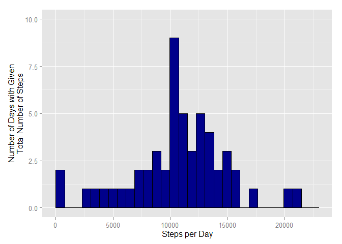
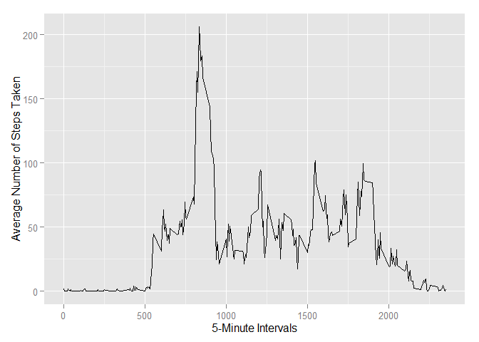
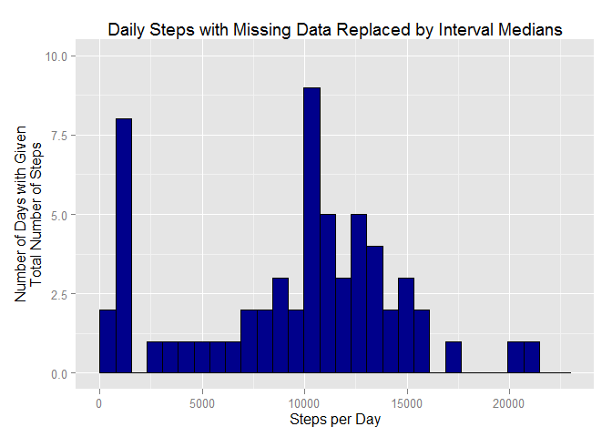
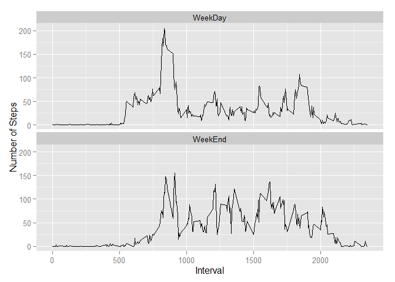

# Reproducible Research: Peer Assessment 1


## Loading and preprocessing the data

Load packages that we will need for the processing of the data and generation
of the graphical figures.


```r
library(plyr)
library(dplyr)
library(ggplot2)
```

Read the activity.csv file into memory which is inside the activity.zip file.


```r
activity <- read.csv(unz("activity.zip", "activity.csv"))
```

Tidy the data by setting the date format and adding a new field for the day number


```r
activity$date <- as.POSIXct(activity$date, format = "%Y-%m-%d")
activity$day <- as.integer(difftime(activity$date, activity$date[1], units = "days"))
```

## What is mean total number of steps taken per day?

Calcuate the mean of steps for each day.


```r
meanStepsPerDay <- activity %>% group_by(day) %>% summarize(count = sum(steps))
```

The Histogram Plot illustrating the total number of steps taken each day.


```r
ggplot(meanStepsPerDay,
    aes(count)) + 
    geom_histogram(stat = "bin", fill = "darkblue", color = "black")+
    scale_x_continuous("Steps per Day", 
        limits = c(0, 23000))+
    scale_y_continuous("Number of Days with Given\nTotal Number of Steps",
        limits = c(0, 10))
```

 

The Mean number of steps per day


```r
mean(meanStepsPerDay$count, na.rm = TRUE)
```

```
## [1] 10766.19
```

The Median number of steps per day


```r
median(meanStepsPerDay$count, na.rm = TRUE)
```

```
## [1] 10765
```


## What is the average daily activity pattern?

Calculate the Averages


```r
averages <- aggregate(x=list(steps=activity$steps), 
    by=list(interval=activity$interval),
    FUN=mean, na.rm=TRUE)
```

Plot the Average Daily Activity


```r
ggplot(data=averages, aes(x=interval, y=steps)) +
    geom_line() +
    xlab("5-Minute Intervals") +
    ylab("Average Number of Steps Taken")
```

 

The 5-minute interval, on average over all the days, that contains the maximum
number of steps taken.


```r
averages[which.max(averages$steps),]
```

```
##     interval    steps
## 104      835 206.1698
```

## Imputing missing values

The number of missing values


```r
sum(is.na(activity))
```

```
## [1] 2304
```

In a new dataframe, replace missing values using the median step value for that
time interval across all days.


```r
activityPlus <- ddply(activity, .(interval), mutate, 
    steps=ifelse(is.na(steps), median(steps, na.rm=TRUE), steps))
```

Using the new dataset, calculate the daily maximum number of steps and plot a
histrogram to illustrate how the data shifts as a result of replacing the
missing data.


```r
meanStepsPerDayPlus <- activityPlus %>% group_by(day) %>% summarize(count=sum(steps))

ggplot(meanStepsPerDayPlus,
    aes(count)) + 
    geom_histogram(stat = "bin", fill = "darkblue", color = "black")+
    scale_x_continuous("Steps per Day", 
        limits = c(0, 23000))+
    scale_y_continuous("Number of Days with Given\nTotal Number of Steps",
        limits = c(0, 10))+
    labs(title = "Daily Steps with Missing Data Replaced by Interval Medians")
```

```
## stat_bin: binwidth defaulted to range/30. Use 'binwidth = x' to adjust this.
```

 

The Mean and Median number of steps per day


```r
mean(meanStepsPerDayPlus$count)
```

```
## [1] 9503.869
```

```r
median(meanStepsPerDayPlus$count)
```

```
## [1] 10395
```

The mean and median for number of steps have lowered since replacing the missing
values.  This is the opposite of what logic would expect since the missing
values are defaulted to zero.  One would think that by adding the mean
values as defaults, replacing the zeros, that the total mean and median numbers
would increase.  Further analysis of the data is required to determine the
reason for this anomaly.

## Are there differences in activity patterns between weekdays and weekends?

Calculate the week day type for each entry in the new dataset.


```r
WeekDayOrWeekEnd <- function(date)
{
    switch(weekdays(date),
        Monday={"WeekDay"},
        Tuesday={"WeekDay"},
        Wednesday={"WeekDay"},
        Thursday={"WeekDay"},
        Friday={"WeekDay"},
        Saturday={"WeekEnd"},
        Sunday={"WeekEnd"})
}
activityPlus$WeekDayType <- sapply(activityPlus$date, FUN=WeekDayOrWeekEnd)
weekDayTypeActivity <- aggregate(steps ~ interval + WeekDayType, data=activityPlus, mean)
```

A plot illustrating the number of steps taken on weekdays vs weekends


```r
ggplot(weekDayTypeActivity,
    aes(interval, steps)) +
    geom_line() +
    facet_wrap(~WeekDayType, ncol=1) +
    xlab("Interval") +
    ylab("Number of Steps")
```

 
